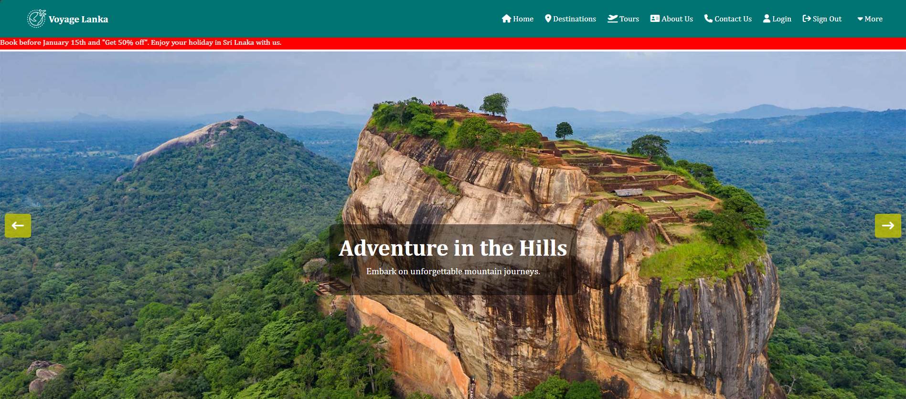
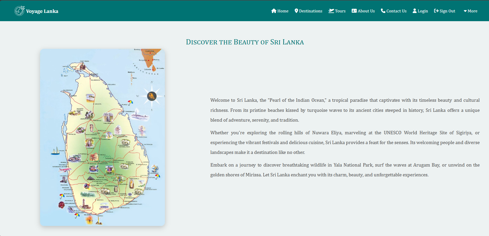
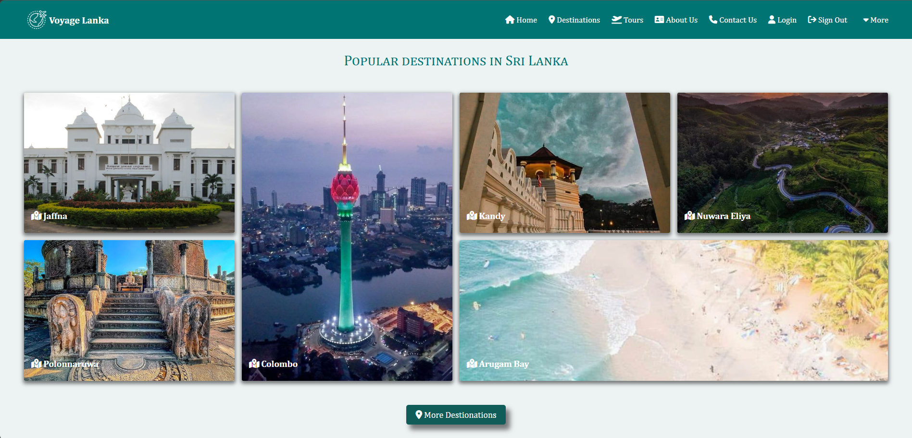
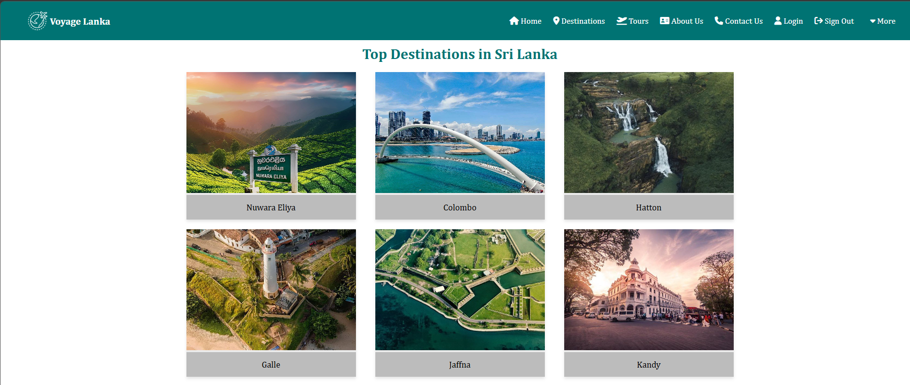
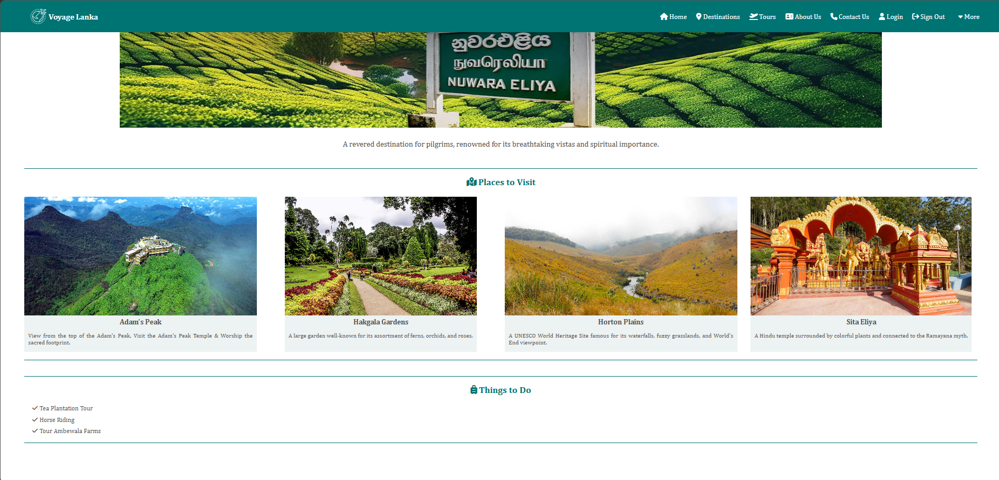
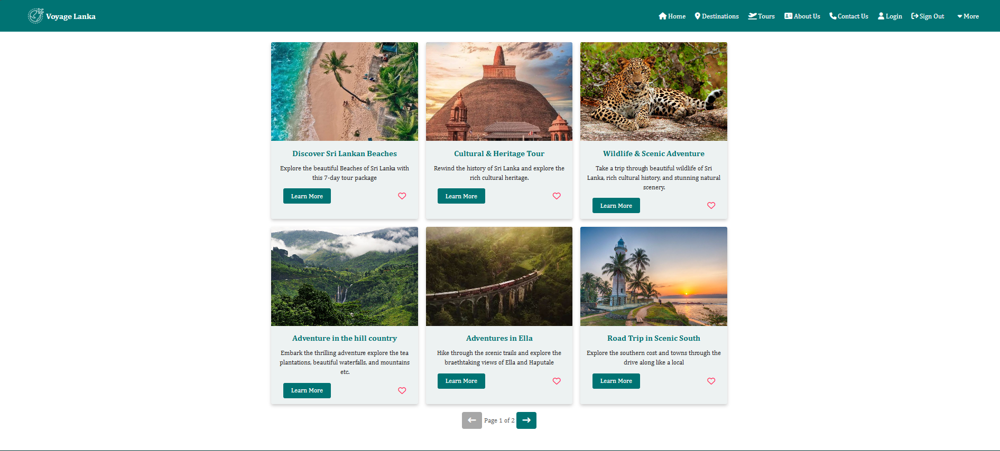
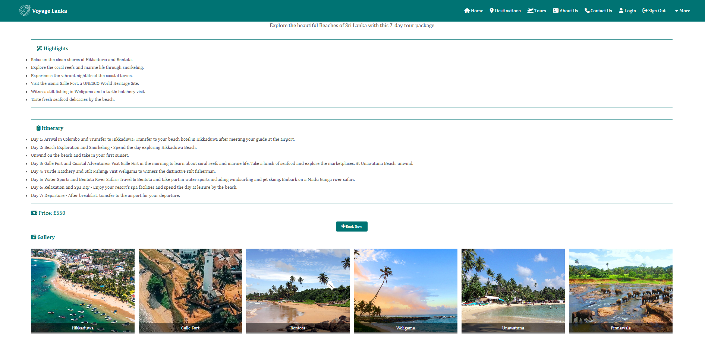
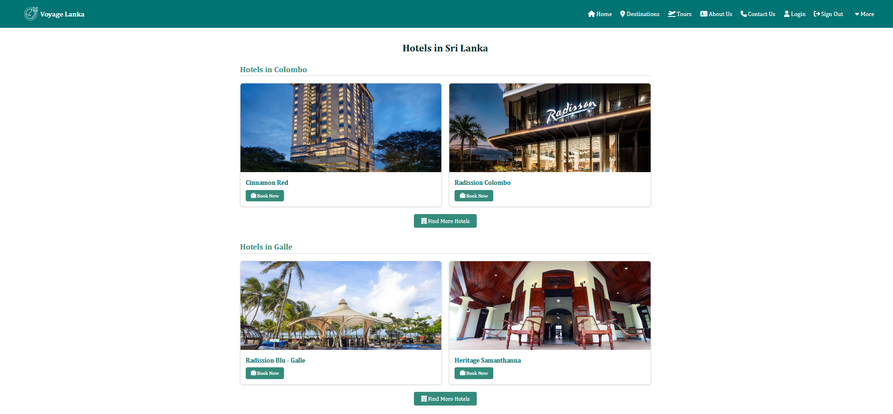
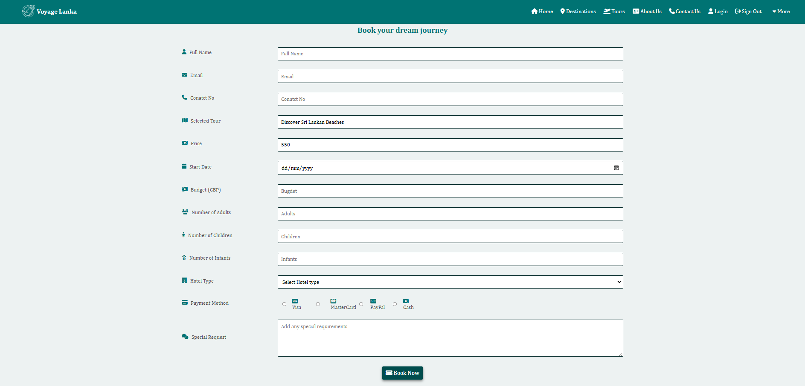

# Voyage Lanka Travel 

A full-stack travel web application designed to help users explore and plan trips across Sri Lanka. The platform provides real-time data updates, secure authentication, and a smooth user experience.

## Live Website

[https://voyagelankatravel.netlify.app/](https://voyagelankatravel.netlify.app/)

---

## Features

* User Authentication (Login / Signup)
* Real-time database integration
* Explore popular travel destinations in Sri Lanka
* Responsive design
* Cloud deployment using Netlify
* Dynamic data handling with Firebase

---

## Tech Stack

**Frontend:**

* HTML5
* CSS3
* JavaScript
* Fontawesome Icons

**Backend / Services:**

* Firebase Authentication
* Firebase Realtime Database

**Deployment:**

* Netlify

---

## Installation & Setup

1. Clone the repository:

```bash
git clone https://github.com/Saranja-Navaneethakumar/VoyageLanka
```

2. Navigate into the project folder:

```bash
cd voyage-lanka-travel
```

3. Open the project:
 * Simply open index.html in your browser

4. Set up Firebase:

* Create a Firebase project
* Enable Authentication
* Enable Realtime Database
* Replace the configuration inside `firebase-config.js` with your Firebase credentials
```bash
const firebaseConfig = {
  apiKey: "YOUR_API_KEY",
  authDomain: "YOUR_AUTH_DOMAIN",
  databaseURL: "YOUR_DATABASE_URL",
  projectId: "YOUR_PROJECT_ID",
  storageBucket: "YOUR_STORAGE_BUCKET",
  messagingSenderId: "YOUR_SENDER_ID",
  appId: "YOUR_APP_ID"
};
```
---

## Screenshots














---

## Future Improvements

* User reviews & ratings
* Interactive maps integration
* Payment gateway support
* Email Notification

---

## Author

Developed by **Saranja Navaneethakumar**

---
